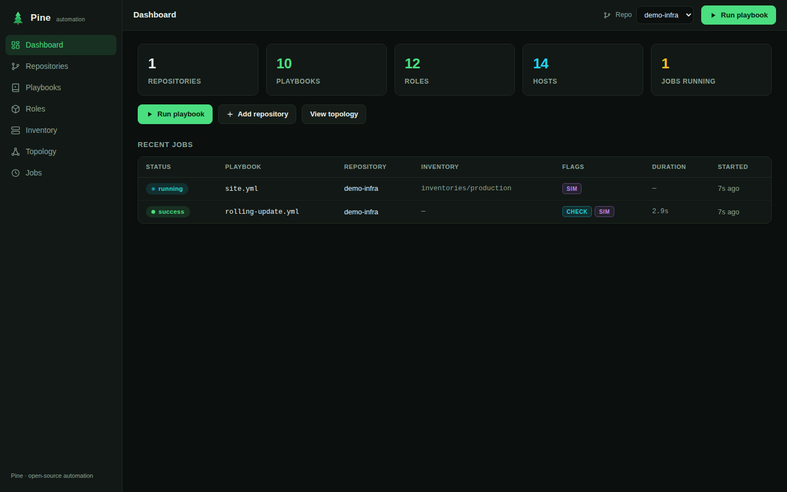
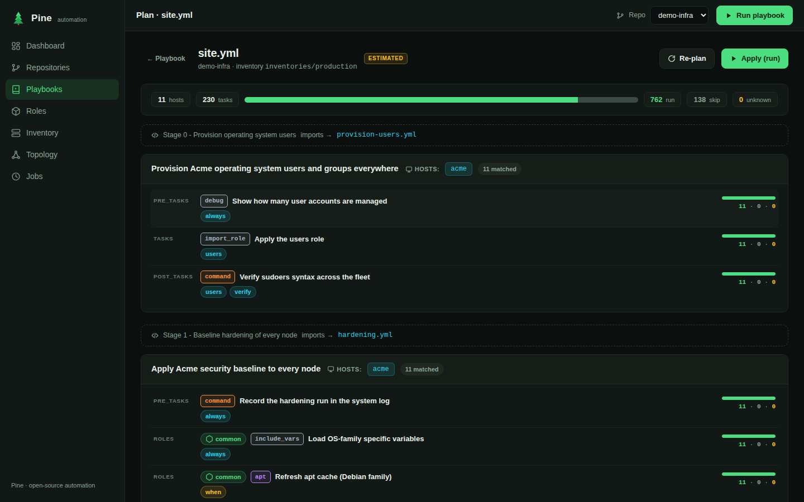
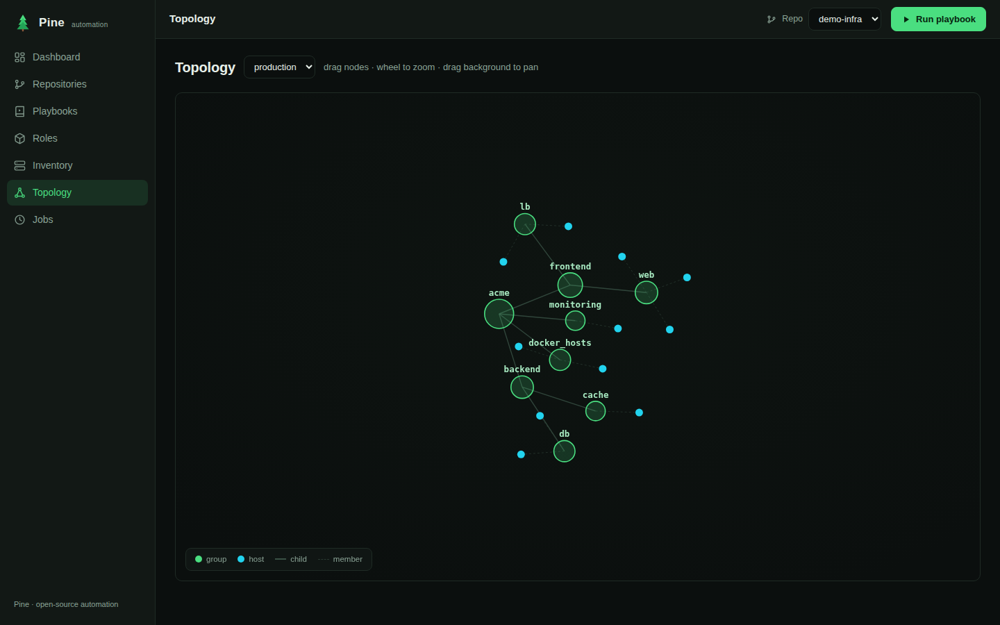
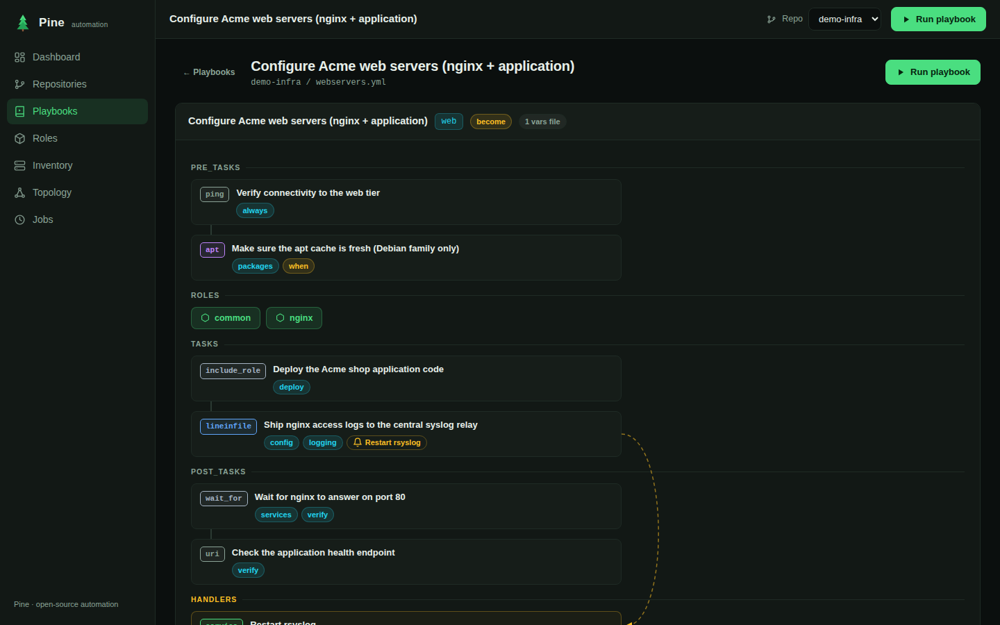
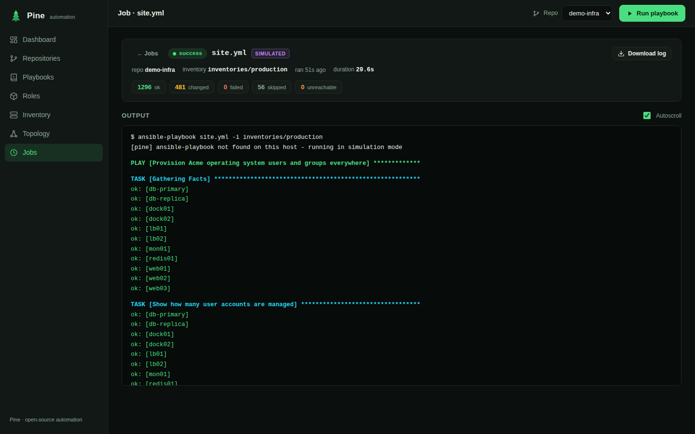
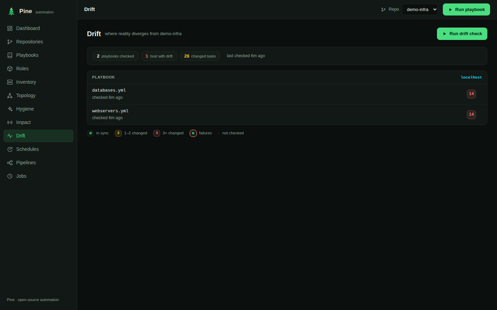
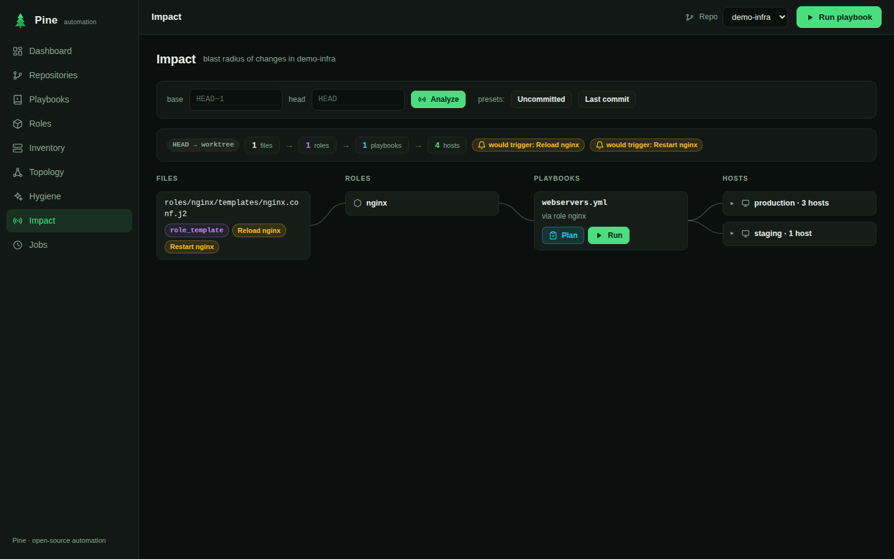
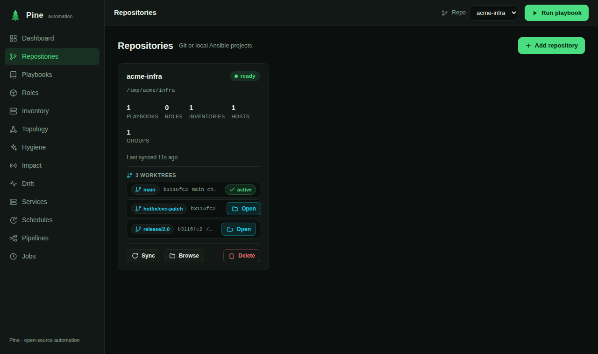

# Pine 🌲

**The Ansible control plane that doesn't need a control plane.**

Pine is a modern, single-binary alternative to AWX / Ansible Tower. No
Kubernetes operator, no PostgreSQL, no RabbitMQ — one Go binary, plain JSON
storage, a polished web UI, a full terminal UI, a CLI and a REST API.



| Plan mode | Inventory topology |
|---|---|
|  |  |

| Playbook task-flow | Live job output |
|---|---|
|  |  |

| Drift heatmap | Blast radius |
|---|---|
|  |  |

| Git worktrees | |
|---|---|
|  | |

## Why Pine?

| | AWX / Tower | Pine |
|---|---|---|
| Deployment | Kubernetes operator + PostgreSQL + Redis | `docker compose up -d` or one binary |
| Storage | PostgreSQL | plain JSON files |
| Understands your repo | lists playbook files | parses playbooks, roles, inventories, vars, handlers |
| Dry run | `--check` (executes against every host) | **static plan in milliseconds** + `--check` exact mode |
| Interfaces | web | web + TUI + CLI + API |

## Features

### Scan & visualize
- **Multi-repo** — connect any number of Ansible repositories (git URL or
  local path), one-click re-sync.
- **Deep auto-scan** — playbooks, plays, tasks, roles (defaults, handlers,
  meta dependencies), inventories in INI *and* YAML, `group_vars`/`host_vars`.
  Playbooks and roles are discovered **recursively anywhere in the repo**
  (nested `playbooks/<env>/<app>/` and per-project `roles/` layouts just
  work); per-repo **scan paths** override discovery when needed — the UI
  prompts you when a synced repo has zero playbooks.
- **Grouped playbook browser** — playbooks are listed as compact rows
  **grouped by project** (their directory) with a live filter that matches
  on name, path, host pattern or tag; click a host/tag chip to filter by it,
  so you can find a playbook by where it lives or what it targets.
- **Constructed inventories** — split sources (`inventory/00-hosts.yml` +
  `99-constructed.yml`) are merged like `-i inventory/`, and the
  `ansible.builtin.constructed` plugin is emulated (`groups:` Jinja
  conditions + `keyed_groups`), so generated groups appear everywhere with
  a *constructed* badge. No more hand-maintained service groups.
- **Topology graph** — interactive force-directed view of every inventory,
  with a **what-if panel** (preview how variables reshape constructed
  groups) and a **time-lapse** player that replays your inventory's git
  history commit by commit.
- **Task-flow visualization** — plays → roles → tasks with tags,
  conditions, loops, blocks/rescue and notify → handler arrows. Static
  `import_tasks` are **followed and inlined** — the referenced file's tasks
  appear in place (recursively), so the flow is the whole picture; dynamic
  `include_tasks` stay a clickable reference.
- **Inline variable resolution** — `{{ vars }}` in task names and args are
  resolved right in the task-flow (e.g. `{{ docker_local_registry }}/grafana/alloy:{{ alloy_version }}`
  → `registry.acme-corp.example/grafana/alloy:1.5.1`). Resolves host-agnostically
  by default (the constants: role defaults **and `vars/main.yml`** — including
  roles pulled in via `include_role`/`import_role` — plus `group_vars/all`,
  `vars_files` (incl. `{{ playbook_dir }}`-relative paths), play vars and
  `vars_prompt` defaults); a **“resolve as” host picker** adapts to a specific
  host's precedence. Click any variable for its **lineage** (which layer it comes
  from); inside a loop, `{{ item }}` shows the **possible items** instead of the
  placeholder. Unresolved vars are honestly triaged: **runtime/magic** (facts,
  `groups`, …), **defined elsewhere** (pick a host to resolve), or **defined
  nowhere** — flagged red, the clear signal for a typo or a missing
  `--extra-vars`/`set_fact`. Secrets are redacted. A collapsible **Variables
  pane** lists *every* variable the playbook references — resolved ones with
  their full lineage, plus unresolved ones tagged runtime / elsewhere /
  **defined-nowhere** (with a count up top) — and Plan mode resolves task args
  too, not just the name.
- **Syntax-highlighted source preview** — the "View YAML" / raw-file pane
  highlights YAML and INI (keys, strings, numbers, booleans, comments, and
  `{{ jinja }}`), no build step or CDN.
- **Git worktrees** — every working tree attached to a connected repo (the
  main checkout plus any linked worktrees) is listed **under its repo on the
  Repositories page**, with branch, HEAD, and locked/prunable flags. **Switch**
  to a worktree to open that branch's checkout as the active repo (Pine
  registers the worktree path as its own repo). Also via the CLI
  (`pine worktrees PATH`) and the REST API.

### Plan before you apply
A `terraform plan` for Ansible ([design](docs/design/plan-mode.md)):

- **Three-valued static engine** — per task × host: `run`, `skip` (with the
  false condition), or **`unknown` with the exact missing variables**.
  Supply values inline and re-plan live, or pick a built-in **fact
  profile** (ubuntu-24.04, debian-12, rhel-9, …).
- **Fact harvesting** — `[gather facts]` jobs (`ansible -m setup --tree`,
  simulated fallback) store real per-host facts that feed every plan.
- **Exact mode** — with ansible installed, `mode: "exact"` runs
  `ansible-playbook --check` through the JSON callback into the same UI.
- Loop sizes, `serial` batches, predicted handlers, `--limit`/`--tags`/
  `--check`, and **estimated duration** from past run timings.
- Everywhere: web ("Plan" next to every "Run"), TUI (`p`), CLI
  (`pine plan PATH PLAYBOOK -e key=value --profile ubuntu-24.04`,
  exit code 3 when the plan has unknowns — CI-friendly).

### Run
- **Job engine** — live SSE output streaming, per-host recap summaries,
  per-task durations, full history, cancel. Without `ansible-playbook`
  installed, Pine switches to a realistic **simulation mode** (demos,
  dry environments).
- **Run diff** — compare two runs of a playbook: per task × host
  transitions (`ok → changed`, `ok → failed`), new/removed tasks.

### Operate
- **Service status** — heatmap services × hosts for the services each host
  declares (`services: [teamcity-agent, docker]`), with real running/stopped
  state harvested via ansible `service_facts` (tri-state, `unknown` until
  checked; `estimated` without ansible). Status pills also appear on each host
  in the Inventory.
- **Drift detection** — heatmap playbooks × hosts built from the latest
  `--check` run of each playbook: *changed under check = reality diverged*.
- **Plan-gated schedules** — recurring runs that **refuse to fire when the
  plan fingerprint changed** since the last human approval. Review, approve,
  resume.
- **Light pipelines** — chained playbooks with stop-on-failure, canary
  steps via `--limit`, and manual **approval gates**.

### Insights
- **Variable lineage** — "where does this value come from?": the full
  precedence chain per host × variable (role default → group → host),
  overridden layers struck through. With `--playbook`, resolves a **playbook's
  effective variables** — expanding `import_tasks`/`import_playbook` and applying
  `include_vars` in Ansible order (so per-service config like a `dedicated.yaml`
  shows up), `{{ }}` resolved where possible and left as-is otherwise.
- **Hygiene report** — unused roles, never-notified handlers (listen- and
  templated-notify-aware), dead variables, untargeted hosts, **plaintext
  secret detection**, vault usage, and **task-level smells** grouped by rule:
  `command`/`shell` where a native module exists (command-instead-of-module),
  unnamed tasks, `ignore_errors: true`, `shell` without `changed_when`, bare
  `include:`, Jinja-wrapped `when:`, and `state: latest`. A tidiness score folds
  it all in. Also `pine hygiene PATH [--json]` (exit code 4 on a plaintext
  credential — gate your CI).
- **Blast radius** — map a git diff to impacted roles (transitive
  dependents) → playbooks → hosts → handlers, as a ripple visualization
  and as `pine impact` (exit code 3 when hosts are affected — gate your CI).

## Quickstart

### Prerequisites

- **Go 1.24+** to build from source (not needed for the Docker image).
- **git** — Pine clones/pulls connected repos.
- **Ansible** (`ansible-playbook`, and `ansible-vault` for encrypted vars) to
  *run* playbooks, gather facts and compute exact plans. Without it Pine still
  scans, visualizes and plans — it just runs in **simulation mode**.
- **Docker + Docker Compose** only for the container workflow below.

Using [mise](https://mise.jdx.dev)? The bundled `mise.toml` pins Go, Ansible and
Node, so `mise install` gives you a self-contained toolchain (Docker and git
stay as system prerequisites). Pine also finds an Ansible installed via
mise/asdf/pipx even under a minimal service `PATH`.

### Local (a binary + your repo)

Install the binary, then point it at any Ansible repo:

```bash
go install github.com/jgsqware/pine/cmd/pine@latest   # or: make install

cd ~/my-ansible-repo
pine .                       # scans ., serves the web UI, opens your browser
```

`pine .` runs everything locally — no Docker, no demo data, just Pine and the
repo you point it at. It keeps its state in `<repo>/.pine`. Useful flags:

```bash
pine . --tui                 # scan, then open the terminal UI instead of the web server
pine . --addr :9000          # serve on a different port
pine . --no-open             # don't auto-open the browser
pine /path/to/another-repo   # any directory works, not just .
```

### Docker

```bash
# Docker (recommended) - demo repo pre-loaded
docker compose up -d         # → http://localhost:8743

# From source
go build -o pine ./cmd/pine

./pine .                     # local mode against the current directory
./pine serve --demo          # web UI + API + scheduler on :8743, with the demo repo
./pine tui --demo            # terminal UI (opens its own engine on the data dir)
./pine attach                # terminal UI attached to a running daemon over HTTP
./pine service install       # run `pine serve` as a systemd (user) service

# CLI, no server needed
./pine scan    examples/demo-infra
./pine scan    examples/demo-infra --paths apps/web   # scope discovery in a monorepo
./pine plan    examples/demo-infra rolling-update.yml -i inventories/production
./pine lineage examples/demo-infra -i production --host web01 --redact --json
./pine lineage examples/demo-infra --playbook webservers.yml \
               -i inventories/production --all-hosts --redact --json   # effective playbook vars (include_vars expanded)
./pine hygiene examples/demo-infra                  # dead-code + smells + secrets report (exit 4 on plaintext creds)
./pine impact  examples/demo-infra --base HEAD~1 --head HEAD
./pine worktrees examples/demo-infra                # list the repo's git worktrees
```

`pine lineage PATH -i INVENTORY --host HOST` prints the full variable
precedence chain for one host (role default → group → host, effective value
last) — the CLI face of the **Variable lineage** insight. `--paths SUBDIR`
(repeatable / comma-separated, shared with `pine scan`) scopes discovery to a
project inside a monorepo; `--redact` masks vault blobs and plaintext secrets
on Pine's side, `--json` emits the raw `LineageResult`.

Connect repositories in the web UI (**Repositories → Add repository**) by
git URL — Pine clones and keeps a managed working copy — or by local path
(mount it into the container when using Docker). Every sync re-scans.

### Run Pine as a service

`pine service install` writes a systemd **user** unit (`~/.config/systemd/user/pine.service`)
pointing at the current binary, then enables and starts it:

```bash
pine service install              # --addr :8743 --data ~/.pine --demo all optional
pine service status               # systemctl --user status pine
pine service uninstall            # stop & remove the unit
```

It runs under your account (so it has your git/SSH credentials) and restarts on
failure. To keep it running at boot before you log in, enable linger once:
`sudo loginctl enable-linger $USER`.

> **Once it's running**, drive it from a terminal with **`pine attach`**
> (`--addr` / `PINE_ADDR` to point elsewhere). Pine's store is single-writer, so
> `pine tui` would open a *second* engine on the same files — it now warns when
> it detects a running daemon and points you to `attach`.

## Battle-tested on real repositories

Pine's scanner and engines are validated against three of the most popular
public Ansible repositories:

| Repository | Scanned | Plan engine |
|---|---|---|
| [ansible-nas](https://github.com/davestephens/ansible-nas) (3.7k ⭐) | 107 roles, 2 inventories | 420 tasks planned in 37 ms — 134 run / 275 skip / 11 unknown (register vars) |
| [ansible-for-devops](https://github.com/geerlingguy/ansible-for-devops) (9.7k ⭐) | 63 playbooks across nested chapter layouts | — |
| [debops](https://github.com/debops/debops) (1.4k ⭐) | **240 playbooks, 203 roles** | 422-task playbook planned in 24 ms; hygiene report in 121 ms |

## Security

Pine's API executes `ansible-playbook` and clones git repositories, so it is
**secure by default**:

- **Loopback by default** — `pine .` and `pine serve` bind `127.0.0.1:8743`.
  Binding a non-loopback address (`:8743`, `0.0.0.0:…`) **requires an API token**
  (`--token` / `PINE_TOKEN`); Pine refuses to start otherwise (override with
  `--insecure` only behind a trusted proxy).
- **Token auth** — when a token is set, every `/api/` call must present it as a
  `Authorization: Bearer …` or `X-Pine-Token` header (the web UI prompts once and
  remembers it; the SSE stream uses `?token=`). Docker ships with `PINE_TOKEN` in
  `docker-compose.yml` — change it before deploying.
- **CSRF protection** — state-changing requests from a foreign `Origin` are
  rejected, so a malicious page cannot drive a Pine running on your machine.
- **Git transport allowlist** — only `https`/`http`/`git`/`ssh` URLs are cloned;
  git transport-helper syntax (`ext::`, `fd::`) is blocked, defusing remote code
  execution via a crafted repo URL (`GIT_ALLOW_PROTOCOL` is enforced too).
- **Secrets never leak** — vault passwords are redacted out of every API read,
  the `lineage`/`resolve` endpoints mask vault blobs and password-like values,
  and the data directory (`state.json`, jobs, facts) is written `0600`/`0700`.

```bash
pine serve --addr 0.0.0.0:8743 --token "$(openssl rand -hex 24)"   # exposed + authenticated
curl -H "Authorization: Bearer $PINE_TOKEN" localhost:8743/api/stats
```

## REST API

| Method & path | Purpose |
|---|---|
| `GET /api/version` | deployed version + build time (also shown in the UI footer) |
| `GET /api/stats` | dashboard counters + recent jobs |
| `GET/POST /api/repos`, `PATCH/DELETE /api/repos/{id}` | manage repositories (`scan_paths` included) |
| `POST /api/repos/{id}/sync` | pull + re-scan |
| `GET /api/repos/{id}/scan` | full scan result |
| `GET /api/repos/{id}/topology?inventory=…` | inventory graph |
| `POST /api/plans` | compute a plan (vars, host_vars, fact_profile, mode, vault_password) |
| `GET /api/fact-profiles` | built-in fact presets |
| `POST /api/repos/{id}/inventory-preview` | what-if constructed groups |
| `GET /api/repos/{id}/lineage?inventory=…&host=…` | variable precedence chains |
| `GET /api/repos/{id}/resolve?playbook=…[&inventory=…&host=…]` | a playbook's effective vars + lineage for inline `{{ }}` resolution |
| `GET /api/repos/{id}/hygiene` | dead-code + task-smells + secrets report |
| `GET /api/repos/{id}/impact?base=…&head=…` | blast radius of a git diff |
| `GET/POST /api/repos/{id}/facts[/refresh]` | harvested facts |
| `GET/POST /api/repos/{id}/drift[/check]` | drift heatmap / launch checks |
| `GET/POST /api/repos/{id}/services[/refresh]` | service-status heatmap / launch a check |
| `GET /api/repos/{id}/timelapse?inventory=…` | topology history frames |
| `GET /api/repos/{id}/worktrees` | git worktrees of the repo's working copy |
| `/api/schedules…` | plan-gated recurring runs (CRUD, approve, run-now) |
| `/api/pipelines…`, `/api/pipeline-runs…` | chained playbooks, approval gates |
| `GET/POST /api/jobs`, `GET /api/jobs/{id}/events` (SSE), `…/log`, `…/diff?with=…`, `POST …/cancel` | jobs |

Errors are JSON `{"error": "…"}`. Launch a job:

```bash
curl -X POST localhost:8743/api/jobs -d '{
  "repo_id": "r_xxxx",
  "playbook": "rolling-update.yml",
  "inventory": "inventories/production",
  "limit": "web", "tags": "deploy", "check": false
}'
```

## The Acme Corp demo (`examples/demo-infra`)

A deliberately rich setup used by `--demo` and the presentation website:
3 inventories (INI production — 11 hosts / 12 groups, YAML staging, and a
constructed-plugin homelab), 12 roles and 11 playbooks covering user
management, per-OS packages, files & templates, systemd services and
timers, Docker + Compose v2 stacks, PostgreSQL, HAProxy/Nginx, monitoring,
hardening, backups and `serial: 1` rolling updates with LB draining.

A static, dependency-free product site lives in [`website/`](website/)
(`make website` serves it on :8080).

## Project layout

```
cmd/pine/             CLI entrypoint (serve | tui | attach | service | scan | plan | impact)
internal/scanner/     Ansible parser: playbooks, roles, inventories,
                      constructed plugin, tri-state Jinja evaluator
internal/plan/        plan engine, lineage, hygiene, impact, time-lapse,
                      exact mode, fact profiles
internal/runner/      git sync, job execution + simulation, facts, drift,
                      service status, scheduler, pipelines, run diff
internal/server/      REST API, SSE streams, embedded web UI
internal/store/       JSON persistence (repos, jobs, facts, schedules…)
internal/tui/         bubbletea terminal UI
web/                  embedded single-page web UI
website/              static presentation site
examples/demo-infra/  the Acme Corp demo repository
```

See [ROADMAP.md](ROADMAP.md) for what's done and what's next.

## License

MIT
