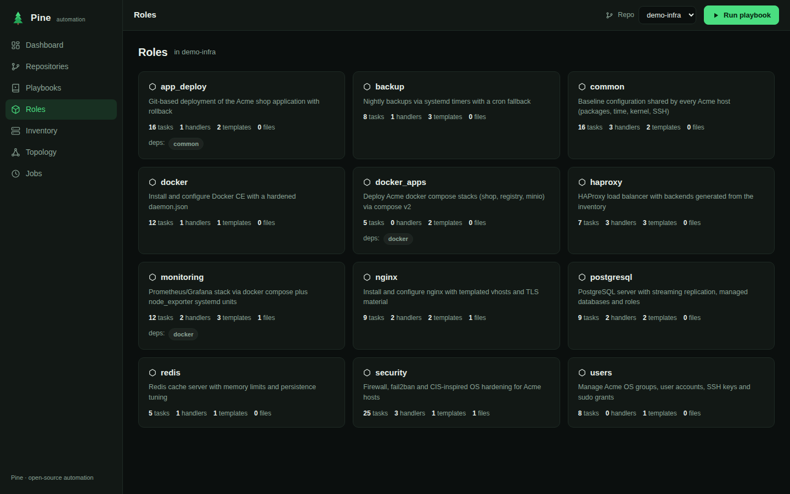

# Pine 🌲

**The Ansible control plane that doesn't need a control plane.**

Pine is a modern, single-binary alternative to AWX / Ansible Tower. No
Kubernetes operator, no PostgreSQL, no RabbitMQ — just one Go binary, plain
JSON storage, a polished web UI, a full terminal UI and a REST API.


| Inventory topology | Playbook task-flow |
|---|---|
|  |  |

| Live job output | Roles |
|---|---|
|  |  |

## Features

- **Multi-repo** — connect any number of Ansible repositories (git URL or
  local path), with one-click re-sync
- **Auto-scan** — playbooks, plays, tasks, roles (defaults, handlers, meta,
  dependencies), inventories in INI *and* YAML, `group_vars` / `host_vars`.
  Playbooks are discovered **recursively anywhere in the repo** (`.yml` and
  `.yaml`), so nested layouts like `playbooks/<env>/<app>/deploy.yml` just
  work; role/inventory internals are skipped automatically. If discovery
  finds nothing (or too much), set per-repo **scan paths** (dirs, files or
  globs) — the UI prompts you when a synced repo has zero playbooks
- **Constructed inventories** — directories holding split sources
  (`inventory/00-hosts.yml` + `99-constructed.yml`) are merged like
  `-i inventory/`, and the `ansible.builtin.constructed` plugin is emulated:
  `groups:` Jinja conditions over host vars (`'docker' in (services |
  default([]))`, `and`/`or`/`not`, `==`, `is defined`, …) and `keyed_groups`
  are evaluated, so generated groups show up in the UI, topology and TUI
  with a *constructed* badge — no need to maintain the service axis by hand
- **Topology graph** — interactive force-directed visualization of your
  inventories (groups, children, hosts)
- **Task-flow visualization** — plays → roles → tasks with tags, conditions,
  loops, blocks/rescue and notify → handler links
- **Plan mode** — a `terraform plan` for Ansible: predict per task × host
  what would run, skip or stay **unknown** before applying anything.
  Three-valued evaluation over the scanned repo: when a verdict depends on
  variables Pine doesn't have, it tells you *which ones* and lets you supply
  values (or pick a built-in **fact profile**: ubuntu-24.04, debian-12,
  rhel-9, …) and re-plan live. Loop sizes, serial batches, notified
  handlers, `--check`/`--limit`/`--tags` all accounted for. Available in
  the web UI ("Plan" next to every "Run"), the TUI (`p`) and the CLI
  (`pine plan PATH PLAYBOOK -e key=value --profile ubuntu-24.04`).
  Topology gets a **what-if** panel: preview how variables reshape
  constructed groups. See [docs/design/plan-mode.md](docs/design/plan-mode.md)
- **Job engine** — run playbooks with `--check`, `--limit`, `--tags`; live
  output streaming over SSE; per-host recap summaries; full history.
  When `ansible-playbook` isn't installed, Pine switches to a realistic
  **simulation mode** (great for demos and dry environments)
- **Web UI + TUI + REST API** — same engine, three interfaces

## Quickstart

### Docker (recommended)

```bash
docker compose up -d
# open http://localhost:8743 — the Acme Corp demo repo is pre-loaded
```

### From source

```bash
go build -o pine ./cmd/pine

./pine serve --demo          # web UI + API on :8743, with the demo repo
./pine tui --demo            # terminal UI
./pine scan examples/demo-infra   # one-shot scan, JSON to stdout
```

## Connecting repositories

In the web UI: **Repositories → Add repository**, then either:

- a **git URL** (`https://github.com/you/ansible-infra.git`, optional branch) —
  Pine clones and keeps a managed working copy under its data dir;
- a **local path** — Pine scans the directory in place (mount it into the
  container if you run Docker).

Every sync re-scans the repo: playbooks, roles and inventories appear
immediately in the UI, the TUI and the API.

## REST API

| Method & path | Purpose |
|---|---|
| `GET /api/stats` | dashboard counters + recent jobs |
| `GET/POST /api/repos` | list / connect repositories |
| `PATCH /api/repos/{id}` | update name / branch / `scan_paths`, then re-scan |
| `POST /api/repos/{id}/sync` | pull + re-scan |
| `GET /api/repos/{id}/scan` | full scan result (playbooks, roles, inventories) |
| `GET /api/repos/{id}/topology?inventory=…` | inventory graph (nodes + links) |
| `POST /api/plans` | compute an estimated plan (vars, host_vars, fact_profile) |
| `GET /api/fact-profiles` | built-in fact presets |
| `POST /api/repos/{id}/inventory-preview` | what-if constructed groups |
| `GET/POST /api/jobs` | job history / launch a playbook |
| `GET /api/jobs/{id}/events` | live SSE stream (`line` + `status` events) |
| `GET /api/jobs/{id}/log` | raw log |
| `POST /api/jobs/{id}/cancel` | stop a running job |

Launch a job:

```bash
curl -X POST localhost:8743/api/jobs -d '{
  "repo_id": "r_xxxx",
  "playbook": "rolling-update.yml",
  "inventory": "inventories/production",
  "limit": "web",
  "tags": "deploy",
  "check": false
}'
```

## The Acme Corp demo (`examples/demo-infra`)

A deliberately rich Ansible setup used by the demo and the presentation
website: 2 inventories (INI production with 11 hosts / 12 groups, YAML
staging), 12 roles and 11 playbooks covering user management, packages per
OS family, files & templates, systemd services and timers, Docker + Compose
v2 stacks, PostgreSQL, HAProxy/Nginx, monitoring (Prometheus/Grafana),
hardening, backups and `serial: 1` rolling updates with LB draining.

```bash
./pine serve --demo
```

## Presentation website

A static, dependency-free product site lives in [`website/`](website/):

```bash
make website   # serves it on :8080
```

## Project layout

```
cmd/pine/          CLI entrypoint (serve | tui | scan | plan)
internal/scanner/  Ansible repo parser (playbooks, roles, INI/YAML inventories)
internal/store/    JSON persistence (repos, jobs, logs)
internal/runner/   git sync, scan cache, job execution + simulation
internal/plan/     estimated plan engine (tri-state eval, fact profiles)
internal/server/   REST API, SSE streams, embedded web UI
internal/tui/      bubbletea terminal UI
web/               embedded single-page web UI
website/           static presentation site
examples/demo-infra/  the Acme Corp demo Ansible repository
```

## License

MIT
